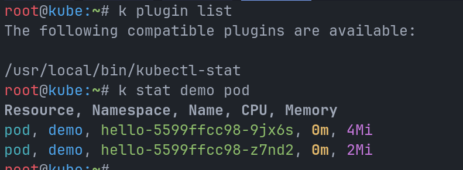
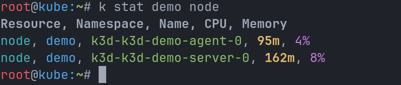

# WEEK 5: kubectl-stat Plugin

A lightweight `kubectl` plugin written in Bash that retrieves CPU and memory resource usage statistics for Kubernetes pods or nodes and formats the output into a clean, color-coded structure.

Vendor: <https://kubernetes.io/docs/tasks/extend-kubectl/kubectl-plugins/>

## Demo




---

## Installation

```bash
git clone https://github.com/devops202607/week5.git
cd week5
chmod +x kubeplugin
sudo cp kubeplugin /usr/local/bin/kubectl-stat
```


